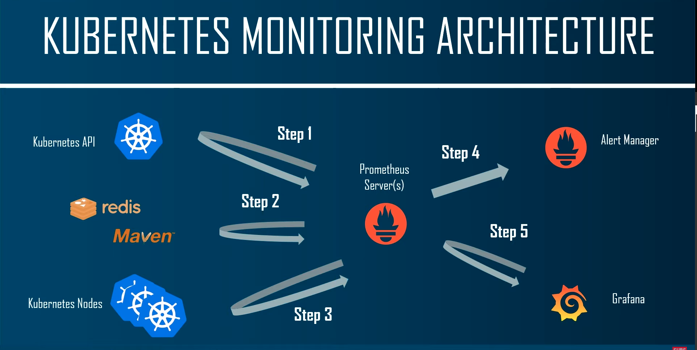

# Kubernetes monitoring with Prometheus and Graphana

> **What is Prometheus ?**
> 
> Prometheus is a software application used for event monitoring and alerting.
 
> **Why use Prometheus ?**
> 
> It records real-time metrics in a time series database built using a HTTP pull model.

> **What is Grafana ?**
>
> Grafana is a multi-platform open source analytics and interactive visualization web application.

> **Grafana Features**
>
> - Visualize
> - Alert
> - Unify
> - Open

# Kubernetes monitoring architecture
